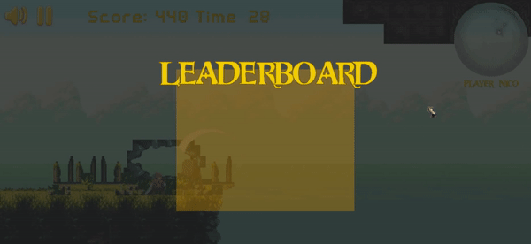

# Phoom a JavaScript Platformer game

Phoom is a Platformer game built with Phaserjs

## Table of Contents

- [Objective](#Objective)
- [Learning process](#Learning-process)
- [Gameplay](#Gameplay)
- [How to Play](#How-to-Play)
- [Technologies Used](#Technologies-Used)
- [Live Version](#Live-version)
- [Install and Run](#How-to-Install-and-Run-in-Your-Computer)
- [Acknowledgments](#Acknowledgments)

### Objective

The main goal of this project is to explore and learn the javascript game engine 'phaser', integrating modern technologies (EcmaScript, webpack, npm) for extending the capabilities of the tool (phaser) while testing some code and consuming third party API's.

In this game you could find:

- A fully functional hero with 3 types of attacks, jumps, and slides
- A set of enemies moving and attacking automatically
- A nice level design with tiles, with a paralax background
- A clock and recolected gems for computing scores
- A leaderboard that shows up at the end of each level
- Nice background music
- Nice User experience 
- Nice set of animations

The following features are under construction:

- Health and item's manager 
- Combat system between characters
- Enemies AI
- Enemies health
- async testing 

 

[Up](#Table-of-Contents)

### Learning process

I decided to integrate a gitBook documentation with this repository for showing step by step how I made this project. The book is still in progress though.

[Make phoom step by step](https://us-central1-js-capstone-backend.cloudfunctions.net/api/)

[Up](#Table-of-Contents)

### Gameplay

1. #### Start Screen

The velocity of the hero is faster for show you the entire map.

When finish the level, it should appear the leaderboard

Next screen is where you control the game. You have 4 options:

4. #### Credits

The credits for this game.

[Up](#Table-of-Contents)

### Languages and technologies used 

- Phaser 3
- JavaScript
- Babel
- ESlint
- npm
- Webpack
- HTML/CSS
- Nodejs
- third party API

[Up](#Table-of-Contents)

### Install in Your local Machine

To run the scripts **npm** is required. To get npm you have to install [Node.js](https://nodejs.org). Follow the installation instructions for your system Mac, Linux or Windows.

Use your terminal and run the commands after each instruction.

| Command                                             | Description                                           |
| --------------------------------------------------- | ----------------------------------------------------- |
| `git clone https://github.com/macnick/RPG-game.git` | Clone the repository to you computer                  |
| `cd RPG-game`                                       | Navigate to the newly created folder                  |
| `npm install`                                       | Install dependencies and launch browser with examples |
| `npm start`                                         | Makes the build and starts the development server     |
|                                                     | Press `Ctrl + c` to kill **http-server** process      |
| `http://localhost:8000`                             | Visit this link to play the game                      |

[Up](#Table-of-Contents)

## Acknowledgements

- Dark Forest Background image By Zeyu Ren 任泽宇
- Button and enemy images by pennomi, Buch, cemkalyoncu at [opengameart.org](https://opengameart.org/)
- Title image created using [textcraft.net](https://textcraft.net)
- Player images by [craftpix.net](https://craftpix.net/)

[Up](#Table-of-Contents)

## 👤 Author

- Github: [@macnick](https://github.com/macnick)
- Twitter: [@mac_experts](https://twitter.com/mac_experts)
- Linkedin: [Nick Haralampopoulos](https://www.linkedin.com/in/nick-haralampopoulos/)

## 🤝 Contributing

Contributions, issues and feature requests are welcome!

Feel free to check the [issues page](https://github.com/macnick/RPG-game/issues).

1. Fork it (https://github.com/macnick/RPG-game/fork)
2. Create your feature branch (git checkout -b my-new-feature)
3. Commit your changes (git commit -am 'Add some feature')
4. Push to the branch (git push origin my-new-feature)
5. Create a new Pull Request

## Show your support

Give a ⭐️ if you enjoyed this project!

## 📝 License

This project is [MIT](lic.url) licensed.
